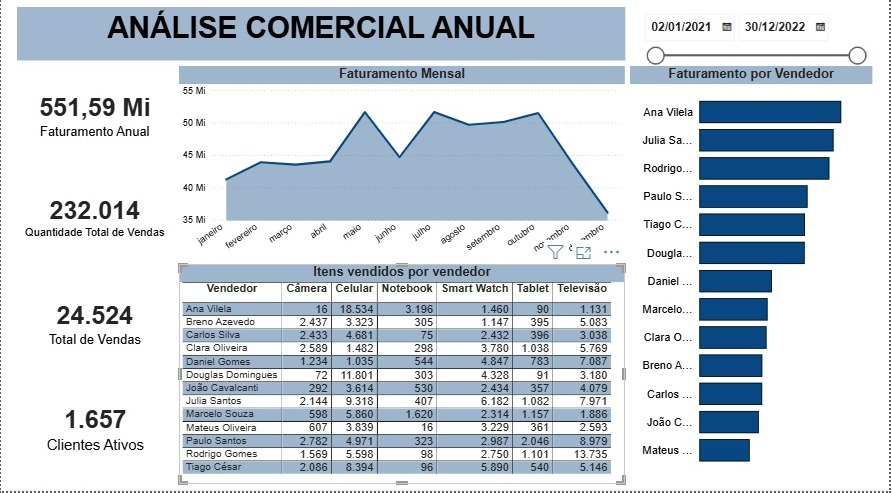

#Análise Comercial Anual

##Sobre o Projeto:
Dashboard desenvolvido no Power BI com foco em análise comercial e acompanhamento de indicadores de vendas ao longo do ano.

O projeto permite visualizar faturamento, desempenho dos vendedores, quantidade de vendas e evolução mensal dos resultados.

---

##Objetivos da Análise:
- Monitorar faturamento anual
- Avaliar desempenho dos vendedores
- Identificar tendências de vendas
- Acompanhar indicadores comerciais

---

##Ferramentas Utilizadas:
- Power BI
- Excel
- DAX
- Modelagem de Dados

---

##Indicadores Analisados:
- Faturamento anual
- Quantidade total de vendas
- Clientes ativos
- Faturamento por vendedor
- Evolução mensal das vendas

---

##Preview do Dashboard

---

##Sobre mim:
Atualmente estou em transição para a área de Dados e Tecnologia, cursando Análise e Desenvolvimento de Sistemas e desenvolvendo projetos práticos com foco em Power BI, SQL e análise de dados.
